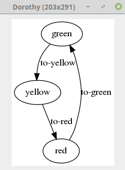

# fsm-clj

A Clojure library designed to create deterministic finite state machines.

- Easy to use flat one level state machine.
- Define state machines that can accumulate values.
- Transitions with actions and guards.
- Graphically visualize the resulting state machines.

Refer to the [documentation](doc/documentation.md) for more details.

## Quick Start

Require the fsm-clj core name space.

```clj
(:require [fsm-clj.core :refer :all])
```

Define a simple traffic light state machine.

```clj
(defsm traffic-light
  [[:green -> :yellow when :to-yellow]
   [:yellow -> :red when :to-red]
   [:red -> :green when :to-green]])
```

Sending events.

```clj
(-> (traffic-light)
    (send-event :to-yellow)
    :state) ;; => :yellow
```

Graphically generate the State Machine (open a Swing viewer).

```clj
(show! (traffic-light))
```



## License

Distributed under the Eclipse Public License either version 1.0 or (at
your option) any later version.
